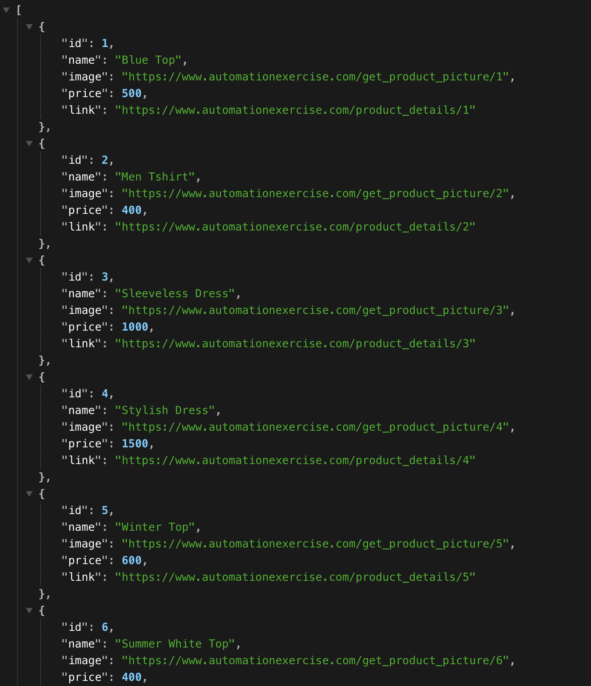

# PHP Web Scraper with Goutte

A basic web scraping example using [Goutte](https://github.com/FriendsOfPHP/Goutte).  
Scrapes product data from [Automation Exercise](https://www.automationexercise.com/).

### Example

<table>
  <tr>
    <td><b>Source Page</b></td>
    <td><b>Scraped Output</b></td>
  </tr>
  <tr>
    <td></td>
    <td></td>
  </tr>
</table>

### Setup

1. Clone the repo
2. Run `composer install`
3. Start a PHP/web server in the project root
4. Visit `index.php` in your browser

This is a simple example of data scraping. I enjoy exploring web scraping and often experiment with different stacks,
including PHP.  
Feel free to connect if you have any questions, need help, or want to discuss anything related to scraping.
